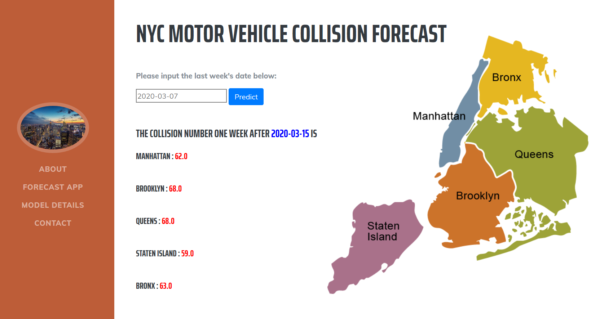

# New York City Motor Vehicle Collision Forecast APP

Sometimes when I drive, the traffic flow stops because of car collisions on the road. I feel sorry for the people who unfortunately got involved in the crash accident, not only for their physical pain but also for the damage and the time they loose. Motor vehicle collisions are a leading cause of injury in the US —they are harmful and expensive.

So I asked myself the following question: what can I do to prevent or forecast crash injuries? Why don’t I use a machine learning model to forecast motor vehicle collision in NYC.

Here is my application that uses a time series forecasting model to predict motor vehicle collision numbers for the 5 boroughs in NYC. The data is updated weekly. Therefore, If you input any day in the last week, the application uses historic data to predict collision numbers for the week later.

[NYC Motor Vehicle Collision Forecast APP] (https://nyc-collision-forecast.herokuapp.com)

## Prerequisites

This app requires Flask, requests, pandas, scikit-learn package installation.

Bootstrap is used to make the APP look better. 

At last, the APP is deployed on Heroku, which makes it public.

## APP Segments

app.py provides application's logic and serves the app using Flask server.

data_process.py is a customed module to process the request input data.

templates file stores html files

static file has models file which contains pickled models. One is trend_model.pkl by to get trend of data;
the other is season_model.pkl to get seasonality of data.

Procfile and requirements.txt are required documents for deploying APP on Heroku.

## Results

The APP uses historic data from any date last week to predict collision numbers for the week later.

